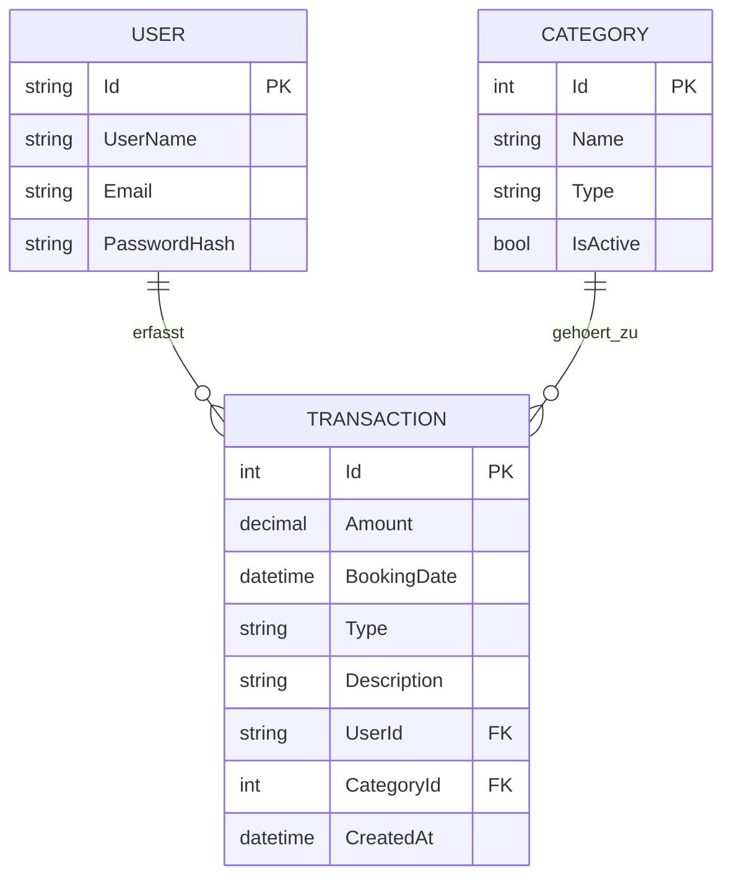

# er-diagramm – budgetbook

quelltext für mermaid, einfach auf https://mermaid.live einfügen und als png oder svg exportieren
für die moodle abgabe

## kardinalitäten

- ein user hat null bis viele transactions (1:n)
- eine category hat null bis viele transactions (1:n)
- eine transaction gehört immer genau zu einem user und einer category

## schlüssel

- USER.Id ist primary key, kommt von aspnet identity (string, guid)
- CATEGORY.Id ist primary key (int, auto increment)
- TRANSACTION.Id ist primary key (int, auto increment)
- TRANSACTION.UserId ist foreign key auf USER.Id
- TRANSACTION.CategoryId ist foreign key auf CATEGORY.Id
